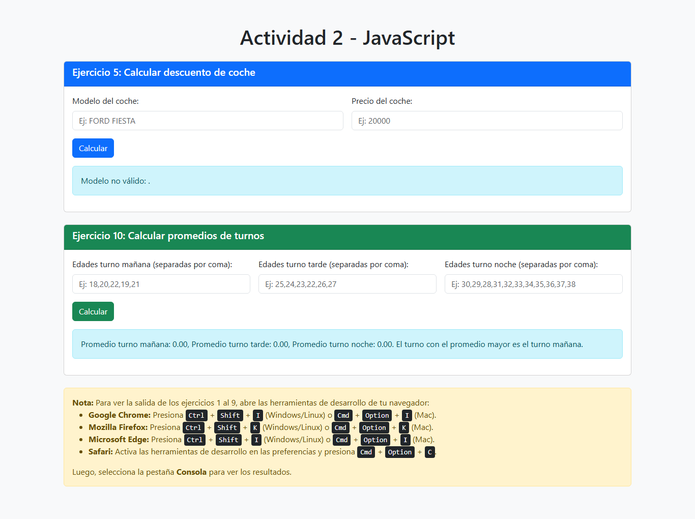

# Actividad 2 - JavaScript 🚀

Este proyecto contiene la solución a una serie de ejercicios prácticos en JavaScript. Los ejercicios abarcan temas como cálculos matemáticos, manipulación de datos, interacción con el DOM y pruebas unitarias. Además, se incluye una interfaz interactiva para algunos ejercicios y un servidor local para facilitar su ejecución.

## Resumen de la solución 📋

1. **Ejercicios implementados**:
   - **EJERCICIO 1**: Determinar si una persona es mayor de edad.
   - **EJERCICIO 2**: Calcular la nota final de un alumno.
   - **EJERCICIO 3**: Calcular el aumento salarial de un trabajador según su categoría.
   - **EJERCICIO 4**: Determinar cuál de dos números es mayor.
   - **EJERCICIO 5**: Calcular el descuento aplicado a un coche según su modelo (interfaz interactiva).
   - **EJERCICIO 6**: Calcular el descuento en viajes turísticos según el destino.
   - **EJERCICIO 7**: Analizar un conjunto de valores enteros.
   - **EJERCICIO 8**: Generar la tabla de multiplicar de un número.
   - **EJERCICIO 9**: Convertir temperaturas de Celsius a Fahrenheit y clasificarlas.
   - **EJERCICIO 10**: Calcular promedios de edades por turnos y determinar el turno con el promedio mayor (interfaz interactiva).

2. **Interfaz interactiva**:
   - Los ejercicios 5 y 10 cuentan con formularios en la página web para ingresar datos y mostrar resultados dinámicamente.
   - Los ejercicios 1 al 9 imprimen resultados en la consola del navegador.

3. **Pruebas unitarias**:
   - Se utilizan pruebas unitarias con Jest para verificar el correcto funcionamiento de las funciones implementadas.

4. **Servidor local**:
   - Se incluye un servidor local (`http-server`) para ejecutar la aplicación en el navegador.

## Instalación y configuración 🛠️

1. **Clonar el repositorio**:
   ```bash
   git clone https://github.com/franklinrony/kodigo-fsj28
   cd actividad2-js
   ```

2. **Instalar dependencias**:
   Asegúrate de tener instalado [Node.js](https://nodejs.org/). Luego, ejecuta:
   ```bash
   npm install
   ```

3. **Ejecutar el servidor local**:
   Para iniciar el servidor y abrir la aplicación en el navegador, ejecuta:
   ```bash
   npm start
   ```

4. **Ejecutar las pruebas unitarias**:
   Para verificar las pruebas unitarias, ejecuta:
   ```bash
   npm test
   ```

## Uso de la aplicación 🌐

1. **Interfaz web**:
   - Abre la aplicación en el navegador (se abrirá automáticamente al ejecutar `npm start`).
   - Ingresa los datos en los formularios de los ejercicios 5 y 10 para ver los resultados.

2. **Salida en consola**:
   - Abre las herramientas de desarrollo del navegador (ver instrucciones en la página web).
   - Ve a la pestaña "Consola" para ver los resultados de los ejercicios 1 al 9.

## Captura de pantalla 📸

A continuación, se muestra una captura de pantalla de la aplicación en funcionamiento:



## Publicar en GitHub Pages 🌐

El proyecto está disponible en GitHub Pages y puede ser accedido desde el siguiente enlace:

[Ver proyecto en GitHub Pages](https://franklinrony.github.io/kodigo-fsj28/ACTIVIDAD2-JS/)


## Integración con GitHub Actions ⚙️

Este proyecto está preparado para integrarse con GitHub Actions para ejecutar pruebas automáticas al realizar push. 
## Tecnologías utilizadas 🛠️

- **JavaScript**: Lenguaje principal para la lógica de los ejercicios.
- **Bootstrap**: Framework CSS para el diseño de la interfaz.
- **Jest**: Framework de pruebas unitarias.
- **http-server**: Servidor local para ejecutar la aplicación.

## Autor ✍️

Desarrollado por Franklin Rony Cortez Barrera (https://github.com/franklinrony/).
