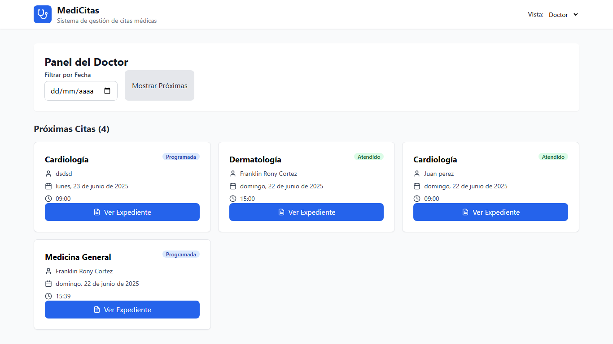

# 🏥 MediCitas - Sistema de Gestión de Citas Médicas

¡Bienvenido a MediCitas! Un sistema moderno y eficiente para la gestión de citas médicas, diseñado para facilitar la interacción entre pacientes y doctores.

---

## 📋 Descripción del Proyecto

MediCitas es una aplicación web que permite a los pacientes agendar citas médicas de forma sencilla, seleccionando especialidades y doctores. Por otro lado, ofrece un panel para doctores donde pueden visualizar su agenda, gestionar sus citas y documentar el historial clínico de sus pacientes, incluyendo diagnósticos y recetas médicas.

### ✨ Características Principales

-   **📅 Agendamiento de Citas:** Los pacientes pueden reservar citas eligiendo especialidad, doctor, fecha y hora.
-   **👨‍⚕️ Panel de Doctor:** Vista especializada para que los doctores gestionen su agenda y vean sus citas programadas.
-   **📝 Gestión de Citas:** Los pacientes pueden reprogramar o cancelar sus citas.
-   **📄 Expediente Clínico:** Los doctores pueden registrar diagnósticos y tratamientos para cada consulta.
-   **💊 Generación de Recetas:** Creación de recetas médicas que se pueden guardar y descargar en formato PDF.
-   **🔄 Actualizaciones en Tiempo Real:** Todos los datos se actualizan instantáneamente gracias a Firebase.

---

## 🛠️ Tecnologías Utilizadas

Este proyecto fue construido con un stack de tecnologías modernas y eficientes:

-   **React:** Para la construcción de la interfaz de usuario.
-   **TypeScript:** Para un desarrollo más robusto y con tipado estático.
-   **Vite:** Como herramienta de construcción y servidor de desarrollo ultrarrápido.
-   **Firebase (Firestore):** Como base de datos en tiempo real y backend de la aplicación.
-   **Tailwind CSS:** Para un diseño de interfaz de usuario moderno y personalizable.
-   **Lucide React:** Para los íconos.
-   **jsPDF:** Para la generación de documentos PDF.

---

## ✍️ Autor

-   **Franklin Rony Cortez**

---

## 🚀 Visualizar el Proyecto

Puedes ver una demostración en vivo del proyecto en el siguiente enlace:

[Ver Demo de MediCitas](https://citas-medicas-kodigo.web.app) 