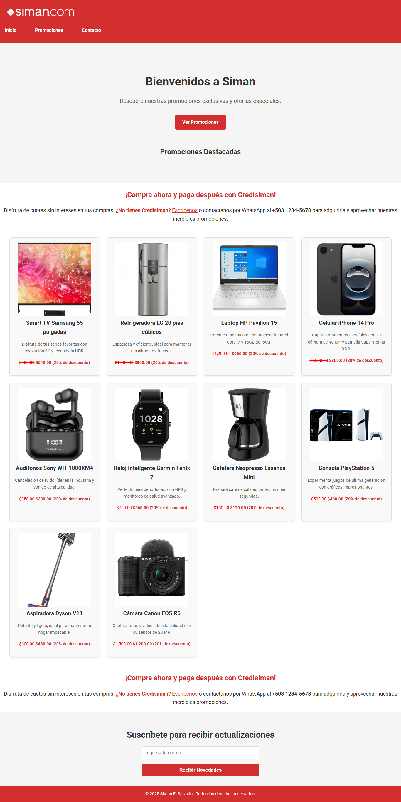

# 🌟 Siman Landing Page

¡Bienvenido al proyecto de la **Landing Page de Siman**! 🎉 Este proyecto consiste en la creación de una página web promocional para **Almacenes Siman**, destacando sus productos, promociones y servicios.

## 📋 Descripción

La landing page incluye las siguientes secciones:

1. **Encabezado y Navegación** 🧭  
   Contiene el logo de Siman y un menú de navegación con enlaces a las páginas principales.

2. **Sección Hero** 🎯  
   Un mensaje de bienvenida con un llamado a la acción para explorar las promociones.

3. **Promociones Destacadas** 🛍️  
   Una galería de productos con descuentos exclusivos.

4. **Información sobre Credisiman** 💳  
   Explicación de cómo funciona el servicio de financiamiento y cómo adquirirlo.

5. **Formulario de Suscripción** 📧  
   Permite a los usuarios suscribirse para recibir actualizaciones y novedades.

6. **Pie de Página** 📜  
   Incluye los derechos reservados y el año actual.

## 🛠️ Tecnologías Utilizadas

- **HTML5** 🌐  
  Para la estructura del contenido.

- **CSS3** 🎨  
  Para el diseño y estilos visuales.

- **Google Fonts** ✍️  
  Para tipografías modernas y atractivas.

## 📂 Estructura del Proyecto

```
siman-landingpage/
├── assets/
│   ├── css/
│   │   └── styles.css
│   ├── images/
│   │   ├── logo-siman.webp
│   │   └── productos/
│   │       ├── smart-tv.jpeg
│   │       ├── refrigeradora-lg.jpeg
│   │       ├── laptop-hp.jpeg
│   │       └── ...
├── index.html
└── README.md
```

## 🚀 Cómo Ejecutar el Proyecto

1. Clona este repositorio en tu máquina local.  
   ```bash
   git clone https://github.com/franklinrony/kodigo-fsj28/
   ```

2. Abre el archivo `index.html` ubicado en SIMAN-LANDIGPAGE en tu navegador favorito.  
   ```bash
   open index.html
   ```

## 📸 Vista Previa



## ✨ Características Destacadas

- **Diseño Responsivo** 📱  
  La página se adapta a diferentes tamaños de pantalla.

- **Promociones Dinámicas** 🔥  
  Productos destacados con descuentos visibles.

- **Interacción con el Usuario** 📨  
  Formulario de suscripción para captar correos electrónicos.


---

💻 **Desarrollado por:** Franklin Rony Cortez Barrera
🗓️ **Fecha:** 26/04/2025
